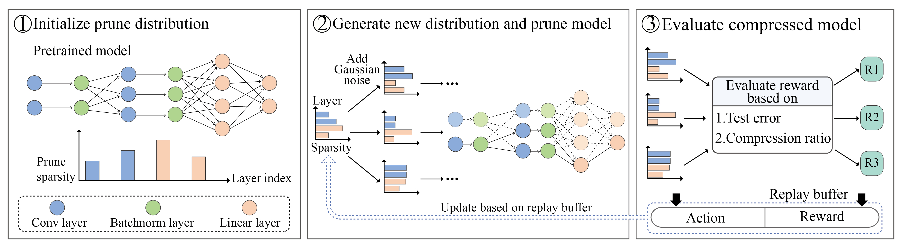
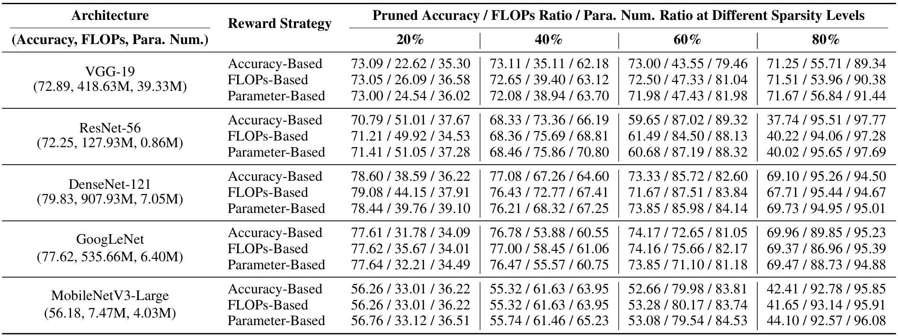

# RL-Pruner: Structured Pruning Using Reinforcement Learning for CNN Compression and Acceleration  

Official PyTorch Implementation for the "RL-Pruner: Structured Pruning Using Reinforcement Learning for CNN Compression and Acceleration" paper  

<p align="center">
    🌐 <a href="https://beryex.github.io/RLPruner-page" target="_blank">Project</a> | 📃 <a href="https://arxiv.org/abs/2411.06463" target="_blank">Paper</a> <br>
</p>



The current release supports:

- RL-Pruner compression for classification CNNs, including VGGNet, ResNet, GoogLeNet, DenseNet, and MobileNet.
- End-to-end structured pruning, which directly returns a compressed architecture, facilitating easy integration with further applications and subsequent compression techniques


## Contents
- [RL-Pruner: Structured Pruning Using Reinforcement Learning for CNN Compression and Acceleration](#rlpruner-a-structural-pruner-based-on-reinforcement-learning-for-cnn-compression-and-acceleration)
	- [Contents](#Contents)
	- [Install](#Install)
	- [Usage](#Usage)
	- [Results](#Results)
   	- [Reference](#Reference)

## Install
1. Clone the repository and aavigate to the RLPruner working directory
```bash 
git clone https://github.com/Beryex/RLPruner-CNN.git --depth 1
cd RLPruner-CNN
```
2. Set up environment
```bash 
conda create -n RLPruner python=3.10 -y
conda activate RLPruner
pip install -r requirements.txt
```


## Usage
RL-Pruner could auto detect the layer dependence inside the model and execute structural pruning. So it can accept any type of CNN without model-wise pruning code implementation. However, RL-Pruner assume that:

- Define the layers to be used during initialization, rather than creating new layers within the 'forward' method. For example, use self.act = nn.ReLU(inplace=True) and def forward(x): return self.act(layer1(x) + layer2(x)), rather than def forward(x): return nn.ReLU(inplace=True)(layer1(x) + layer2(x))
- The layers defined during initialization should be used only once in the forward method, not multiple times. For example, use self.act1 = nn.ReLU(inplace=True), self.act2 = nn.ReLU(inplace=True) and def forward(x): return self.act2(layer2(self.act1(layer1(x)))), rather than self.act = nn.ReLU(inplace=True) and def forward(x): return self.act(layer2(self.act(layer1(x))))

RL-Pruner support grouped convolution, but it will only prune depthwise convolution. Grouped convolution layers that are not depthwise will be skipped during the pruning process.

If you encounter any issues with RL-Pruner failing to detect layer dependencies in a specific CNN model or during the pruning process, please feel free to open an issue.

An example bash script, [scripts/example.sh](scripts/example.sh), demonstrates how to train VGG-19 from scratch on CIFAR-100, compress the model, and evaluate the compression results. Additional scripts for flexible configurations, as well as individual scripts for training, pruning, and evaluation, can be found in the [scripts](scripts) folder. For instance, to train and compress GoogLeNet on CIFAR-100, you can use the following command:
```bash
bash scripts/flexible.sh googlenet cifar100 0.20 taylor 0.00 0.00
```
To experiment with different models and datasets, adjust the script accordingly and save your pretrained model as `{model_name}_{dataset_name}_pretrained.pth` at `pretrained_model` folder. All default hyperparameter settings can be found in [conf/global_settings.py](conf/global_settings.py).


## Results

We conduct experiments on various architectures using the CIFAR-100 dataset.



## Reference
```
@misc{wang2024rlpruner,
      title={RL-Pruner: Structured Pruning Using Reinforcement Learning for CNN Compression and Acceleration}, 
      author={Boyao Wang and Volodymyr Kindratenko},
      year={2024},
      eprint={2411.06463},
      archivePrefix={arXiv},
      primaryClass={cs.CV},
      url={https://arxiv.org/abs/2411.06463}, 
}
```
